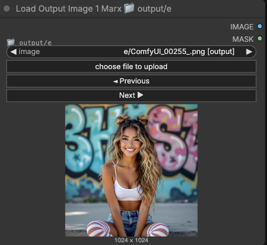

# ComfyUI_Marx

Custom nodes for ComfyUI with configurable folder-based image loading organized by Input and Output
categories.

## Screenshots

### Input Image Loader


Loads images from configured subfolders in the input directory. Features folder path display and
support for nested folders.

### Output Image Loader



Loads images from configured subfolders in the output directory. Features inline preview,
Previous/Next navigation buttons, and support for nested folders.

## Nodes

### Input Image Loaders (3 nodes)

Reads from ComfyUI's **input** directory (`ComfyUI/input/`):

- **Load Input Image 1 Marx** - Reads from folder configured in "Marx Folder Input 1" setting (
  default: `input1`)
- **Load Input Image 2 Marx** - Reads from folder configured in "Marx Folder Input 2" setting (
  default: `input2`)
- **Load Input Image 3 Marx** - Reads from folder configured in "Marx Folder Input 3" setting (
  default: `input3`)

### Output Image Loaders (3 nodes)

Reads from ComfyUI's **output** directory (`ComfyUI/output/`):

- **Load Output Image 1 Marx** - Reads from folder configured in "Marx Folder Output 1" setting (
  default: `output1`)
- **Load Output Image 2 Marx** - Reads from folder configured in "Marx Folder Output 2" setting (
  default: `output2`)
- **Load Output Image 3 Marx** - Reads from folder configured in "Marx Folder Output 3" setting (
  default: `output3`)

## Features

### 🎯 Key Features

- **📁 Folder-based Organization**: Each node reads from its own configured subfolder
- **🏷️ Folder Path Display**: Each node displays its configured folder path (e.g., "📁
  input/portraits")
- **⚙️ Settings Integration**: Configure folder paths via ComfyUI's native settings panel
- **🔄 Navigation Buttons**: Output nodes include Previous/Next buttons for easy image browsing
- **🖼️ Image Preview**: Both input and output nodes support inline image preview
- **🎨 Image Filtering**: Automatically filters to show only image files (PNG, JPG, GIF, WebP, etc.)
- **🚫 Hidden Files Excluded**: Skips .DS_Store and other hidden files
- **📂 Nested Folders**: Full support for subfolders (e.g., `facefusion/background`)

### 🎭 Image Support

- Multiple image formats (PNG, JPG, JPEG, GIF, WebP, BMP, TIFF, AVIF)
- Animated images (GIFs) - loads all frames
- Automatic alpha channel extraction as mask
- EXIF orientation correction
- Returns both IMAGE and MASK outputs

### 🎛️ Node Interface

**Inputs:**

- `folder_path`: (Read-only display) Shows the configured folder path for this node
- `image`: Dropdown selector showing images from the node's configured folder
- `◄ Previous` / `Next ►`: (Output nodes only) Navigation buttons for browsing images

**Outputs:**
- `IMAGE`: The loaded image as a tensor (batch, height, width, channels)
- `MASK`: Alpha channel mask (or empty mask if no alpha channel)

## Installation

1. Clone or copy this directory to your ComfyUI custom_nodes folder:
   ```
   ComfyUI/custom_nodes/ComfyUI_Marx/
   ```

2. Restart ComfyUI

3. Configure folder paths in Settings (see Configuration section below)

4. The nodes will appear under the "Marx/image" category

## Configuration

### Setting Up Folders

1. Open ComfyUI → Click **Settings** (gear icon)
2. Scroll to find **Marx Folder Input/Output** settings:
    - **Marx Folder Input 1-3** - Subfolders relative to `ComfyUI/input/`
    - **Marx Folder Output 1-3** - Subfolders relative to `ComfyUI/output/`
3. Enter subfolder paths
    - Example: `portraits`, `landscapes`, `textures`, etc.
   - Use `.` to reference the root directory
4. Click **Save**
5. Refresh ComfyUI for changes to take effect

### Default Configuration

If no settings are configured, the nodes use these default folders:

- Load Input Image 1 Marx → `ComfyUI/input/input1/`
- Load Input Image 2 Marx → `ComfyUI/input/input2/`
- Load Input Image 3 Marx → `ComfyUI/input/input3/`
- Load Output Image 1 Marx → `ComfyUI/output/output1/`
- Load Output Image 2 Marx → `ComfyUI/output/output2/`
- Load Output Image 3 Marx → `ComfyUI/output/output3/`

### Folder Structure Example

```
ComfyUI/
  ├── input/              # Input nodes read from here
  │   ├── input1/         # Load Input Image 1 Marx
  │   ├── input2/         # Load Input Image 2 Marx
  │   ├── input3/         # Load Input Image 3 Marx
  │   └── portraits/      # Custom folder (configure in settings)
  └── output/             # Output nodes read from here
      ├── output1/        # Load Output Image 1 Marx
      ├── output2/        # Load Output Image 2 Marx
      ├── output3/        # Load Output Image 3 Marx
      └── processed/      # Custom folder (configure in settings)
```

## Usage

1. Configure your folder paths in ComfyUI Settings
2. Create the corresponding folders in `ComfyUI/input/`
3. Add images to those folders
4. Add any Input or Output image loader node to your workflow
5. Select an image from the dropdown
6. Connect the IMAGE and/or MASK outputs to other nodes

**Workflow Example:**

- Load Input Image 1 Marx for base images
- Load Input Image 2 Marx for control images
- Load Input Image 3 Marx for masks
- Load Output Image 1 Marx for generated outputs
- Load Output Image 2 Marx for processed results
- Load Output Image 3 Marx for final renders

## Requirements

- ComfyUI
- PIL (Pillow)
- PyTorch
- NumPy

These dependencies are already included with ComfyUI.

## Documentation

For detailed settings configuration, see [SETTINGS.md](SETTINGS.md)

